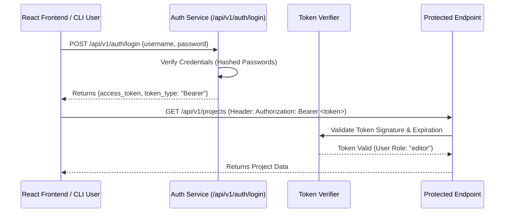

# Authentication, RBAC & Security Specification (`AUTH_FLOW.md`)

**Version**: 1.0.0  
**Module**: `backend.auth` / `backend.apps.api.auth`  

---

## 1. Overview

Spilled Coffee AI Studio implements a secure **JSON Web Token (JWT)** authentication architecture with **Role-Based Access Control (RBAC)** to protect API endpoints, admin operations, and agent execution controls.

---

## 2. Authentication Flow



---

## 3. Role-Based Access Control (RBAC) Hierarchy

```text
ADMIN
  ├── EDITOR
  │     └── VIEWER
  └── SYSTEM (Service-to-Service Agent Authorization)
```

| Role | Permissions |
|---|---|
| **`viewer`** | Read project status, view agent prompt specs, query knowledge base. |
| **`editor`** | Create projects, trigger agent executions, launch workflow DAGs, update assets. |
| **`admin`** | User management, RBAC updates, system config modifications, project deletions. |
| **`system`** | Internal agent-to-agent delegation and background queue task execution. |

---

## 4. JWT Token Claims Schema

```json
{
  "sub": "user_id_102",
  "username": "studio_admin",
  "role": "admin",
  "iat": 1784742400,
  "exp": 1784828800,
  "iss": "spilled_coffee_ai_auth"
}
```

---

## 5. Security Rules & Token Safeguards

1. **Password Hashing**: Passwords stored using `passlib` with `bcrypt` rounds >= 12.
2. **Token Expiration**: Access tokens expire after 24 hours. Refresh tokens required for re-authentication.
3. **Workspace Isolation**: Authenticated sessions cannot access files outside `projects/` directory boundaries.
