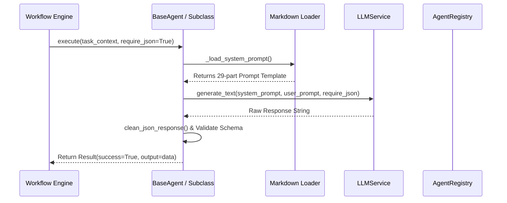

# Core Agent Runtime Specification (`CORE_RUNTIME.md`)

**Version**: 1.0.0  
**Module**: `backend.core` / `agent_runtime`  

---

## 1. Overview

The **Core Runtime Engine** manages the lifecycle, prompt resolution, LLM execution, context passing, and error recovery for all 79 AI agents in Spilled Coffee AI Studio.

---

## 2. Core Execution Protocol

When an agent executes a task, it follows a standardized execution pipeline:



---

## 3. BaseAgent Architecture (`backend/core/base_agent.py`)

Every agent inherits from `BaseAgent`:

```python
class BaseAgent(ABC):
    def __init__(self, agent_name: str, llm_service: Optional[LLMService] = None):
        self.agent_name = agent_name
        self.llm_service = llm_service or LLMService()
        self.system_prompt = self._load_system_prompt()

    def _load_system_prompt(self) -> str:
        prompt_path = os.path.join(
            r"b:\youtubeProjects\Buzzcaf Media\SpilledCoffeeAI\backend\prompts\agents",
            f"{self.agent_name}.md"
        )
        if os.path.exists(prompt_path):
            with open(prompt_path, "r", encoding="utf-8") as f:
                return f.read()
        return f"You are the {self.agent_name} of Spilled Coffee AI Studio."

    def execute(self, task: Any, require_json: bool = False) -> Any:
        self.refresh_prompt()
        return self.llm_service.generate_text(
            system_prompt=self.system_prompt,
            user_prompt=str(task),
            require_json=require_json
        )
```

---

## 4. Dynamic Agent Discovery & Factory (`backend/core/agent.py`)

- **`AgentRegistry`**: Discovers all Markdown prompt files in `backend/prompts/agents/`, parses YAML frontmatter headers (`name`, `department`, `role`, `inputs`, `outputs`, `permissions`), and caches definitions.
- **`AgentFactory.get_agent(agent_role)`**: Maps role strings (case-insensitive) to explicit agent subclasses or instantiates a `GenericAgent` bound to the discovered specification file.

---

## 5. Fault Tolerance & Recovery Rules

1. **Automatic Retries**: If `LLMService` encounters rate limits or temporary network disconnects, it retries up to 3 times with exponential backoff.
2. **JSON Cleaning**: Malformed markdown code blocks around JSON outputs are stripped automatically via `clean_json_response()`.
3. **Fallback Injection**: If an input dependency is missing, default fallback context is injected and a warning is logged via `spilled_coffee_ai.core.base_agent`.
