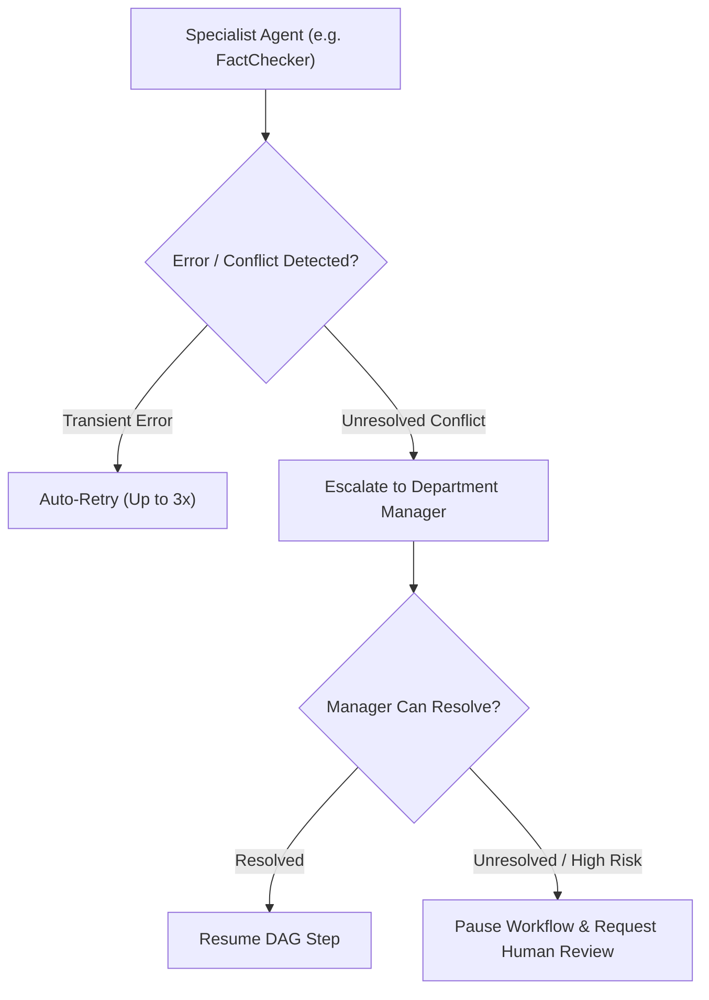

# AI Decision Framework & Escalation Policies (`DecisionMaking.md`)

**Version**: 1.0.0  
**Scope**: All 79 Specialized AI Agents  

---

## 1. Governance & Rule Hierarchy

Every agent in Spilled Coffee AI Studio operates under a strict rule hierarchy when resolving conflicts, task trade-offs, or quality decisions:

```text
Priority Hierarchy
1. Human Operator Overrides (Explicit User Feedback)
2. Master Brand & Channel Guidelines (Beyond3Baje / Khayal3Baje rules)
3. Workflow DAG Constraints & Step Dependencies
4. Department Manager Directives (CEO, ResearchManager, Editor, etc.)
5. Agent Autonomy & Heuristic Planning
```

---

## 2. Decision Rules

1. **Human Override**: Explicit user instructions or feedback ALWAYS take precedence over automated agent decisions.
2. **Brand Guardrails**: No agent may produce content violating target channel tone, brand standards, or safety rules.
3. **Fact Verification**: Creative storytelling must not falsify core historical facts unless explicitly marked as fiction/folklore.
4. **Deadline Priority**: Workflow steps nearing publication deadlines receive priority resource allocation.
5. **No Blind Action**: Agents must fail gracefully and request human/manager review if required inputs are ambiguous or contradictory.

---

## 3. Escalation Protocol

When an agent encounters a blocking error, schema failure, or conflict:



---

## 4. Quality Checklist Gates

Before any agent hands off work to downstream steps:
- [x] Does the output strictly match the expected JSON or Markdown schema format?
- [x] Are all required dependency context files populated and verified?
- [x] Have all brand safety and content compliance rules been validated?
