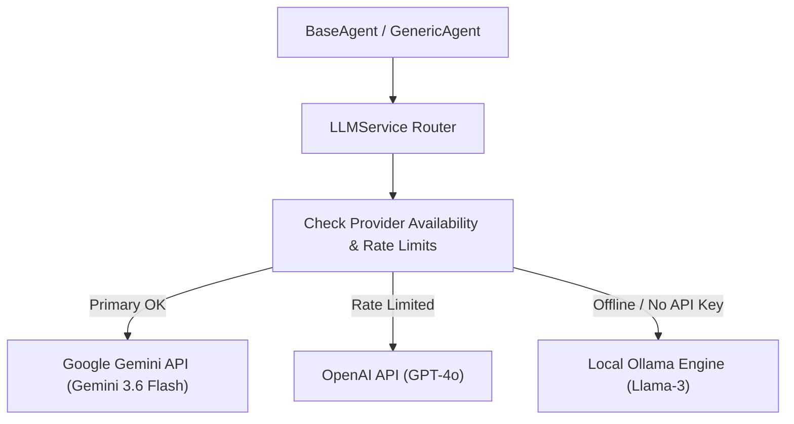

# LLM Provider Router & External API Integrations (`PROVIDERS.md`)

**Version**: 1.0.0  
**Module**: `backend.integrations.llm` / `backend.integrations`  

---

## 1. Overview

The **LLM Router Service** (`LLMService`) decouples agent logic from specific AI provider SDKs. It provides dynamic model routing, automatic retries, fallback cascading, and JSON schema enforcement across Google Gemini, OpenAI, Claude, and local LM Studio / Ollama instances.

---

## 2. Supported LLM Provider Matrix

| Provider | Primary Models | Use Case | Fallback Target |
|---|---|---|---|
| **Google Gemini** | `gemini-3.6-flash`, `gemini-1.5-pro` | Default model for all 79 agents, rapid generation | OpenAI / Local Ollama |
| **OpenAI** | `gpt-4o`, `gpt-4o-mini` | Complex reasoning, fallback for executive agents | Google Gemini |
| **Anthropic** | `claude-3-5-sonnet` | Longform script writing, nuanced editing | Gemini 3.6 Flash |
| **Local / Ollama** | `llama3:8b`, `mistral:7b` | Offline backup, cost-free local processing | LM Studio |

---

## 3. Provider Routing Architecture



---

## 4. Fallback & Retry Logic

```python
class LLMService:
    def generate_text(self, system_prompt: str, user_prompt: str, require_json: bool = False) -> str:
        providers = ["gemini", "openai", "ollama"]
        for provider in providers:
            try:
                response = self._call_provider(provider, system_prompt, user_prompt, require_json)
                if response:
                    return response
            except Exception as e:
                logger.warning(f"Provider '{provider}' failed: {e}. Cascading to next provider...")
        raise RuntimeError("All LLM providers failed to respond.")
```

---

## 5. External Platform Integration Services

In addition to LLMs, Spilled Coffee AI Studio integrates with:
- **YouTube Data API v3**: Uploads videos, sets thumbnails, updates titles/tags/descriptions, and fetches analytics telemetry.
- **ChromaDB Vector Store**: Handles semantic search, embeddings, and RAG for the Knowledge Department.
- **Redis / Celery Queue**: Manages background job queues for image generation and video rendering tasks.
