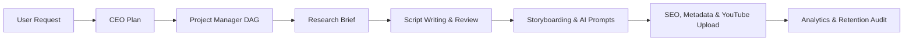

# Workflow Engine & DAG Specification (`WorkflowEngine.md`)

**Version**: 1.0.0  
**Module**: `backend.workflow_engine` / `backend.runtime`  

---

## 1. Overview

The **Workflow Execution Engine** manages multi-agent Directed Acyclic Graphs (DAGs) for content creation pipelines (e.g. Scriptwriting, Visual Storyboarding, Publishing, and Analytics).

---

## 2. Standard Production Pipeline DAG



---

## 3. Workflow Step States & Transitions

Every workflow step transitions through standard lifecycle states:

```text
[PENDING] ──► [RUNNING] ──► [VALIDATING] ──► [COMPLETED]
                │
                └──► [FAILED] ──► [RETRYING] ──► [ESCALATED]
```

- **`PENDING`**: Prerequisites incomplete; waiting for upstream dependencies.
- **`RUNNING`**: Target agent actively executing prompt payload.
- **`VALIDATING`**: Output JSON/Markdown schema validation in progress.
- **`COMPLETED`**: Asset persisted to project workspace; downstream steps unblocked.
- **`FAILED`**: Error encountered; retry logic or human intervention requested.

---

## 4. Example Pipeline DAG Definition (`workflows/youtube_longform.json`)

```json
{
  "workflow_id": "youtube_longform_v1",
  "name": "YouTube Longform Documentary Workflow",
  "steps": [
    {
      "step_id": "step_1_research",
      "target_agent": "ResearchManager",
      "inputs": ["topic_query"],
      "outputs": ["master_research_brief"]
    },
    {
      "step_id": "step_2_story_plan",
      "target_agent": "StoryPlanner",
      "dependencies": ["step_1_research"],
      "outputs": ["narrative_blueprint"]
    },
    {
      "step_id": "step_3_script_write",
      "target_agent": "ScriptWriter",
      "dependencies": ["step_2_story_plan"],
      "outputs": ["full_script_draft"]
    },
    {
      "step_id": "step_4_editing",
      "target_agent": "Editor",
      "dependencies": ["step_3_script_write"],
      "outputs": ["edited_script"]
    },
    {
      "step_id": "step_5_storyboard",
      "target_agent": "StoryboardPlanner",
      "dependencies": ["step_4_editing"],
      "outputs": ["storyboard_manifest"]
    },
    {
      "step_id": "step_6_prompts",
      "target_agent": "PromptEngineer",
      "dependencies": ["step_5_storyboard"],
      "outputs": ["ai_prompt_dossier"]
    },
    {
      "step_id": "step_7_seo_metadata",
      "target_agent": "SEOSpecialist",
      "dependencies": ["step_4_editing"],
      "outputs": ["seo_metadata_brief"]
    }
  ]
}
```

---

## 5. Execution Logic & Context Passing

The `WorkflowExecutor` agent retrieves active DAG definitions, checks prerequisite step completions, injects upstream output files into the context payload, and triggers target agent execution sequentially or in parallel branches.
