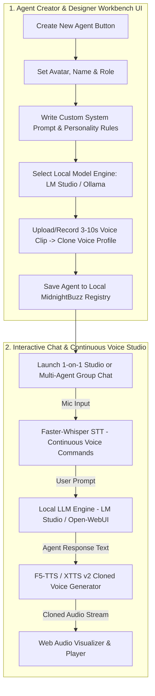

# Implementation Plan: MidnightBuzz - Standalone Agent Creator & Group Chat App

Build **MidnightBuzz** as a brand-new, standalone open-source project located at **`b:\youtubeProjects\Buzzcaf Media\MidnightBuzz`** (renamed from `AgentsGroupChat`), leaving **BuzzcafAI** completely separate and untouched.

**MidnightBuzz** features an interactive **Agent Creator & Designer Workbench UI** where users can create custom AI agents (designing system prompts, avatars, tone, local LLM mappings, and cloned voice profiles) and interact with them in 1-on-1 or multi-agent continuous voice chat rooms powered 100% by local open-source models (**LM Studio / Open-WebUI**, **Faster-Whisper**, and **F5-TTS / XTTS v2**).

---

## 🎨 Interactive User Workflow & Web UI Architecture

---

## 🎛️ Agent Creator & Personality Designer UI Features

### 1. Visual Agent Builder Studio
- **Identity & Branding**: Set Agent Name, Role Title, Custom Avatar image/color gradient, and persona tag.
- **Personality & Prompt Engineer**:
  - Live system prompt editor with template presets (*Lead Strategist*, *Scriptwriter*, *SEO Specialist*, *Thumbnail Director*).
  - Fine-grained controls: Temperature, Top_P, Max Tokens, and Response Style (*Concise*, *Verbose*, *Hinglish*, *Formal*).
- **Local Model Mapping**: Choose which locally loaded model handles this agent's brain (e.g., `qwen2.5-coder` for code, `llama-3.2-3b` for fast chat, `deepseek-r1-8b` for complex reasoning).
- **Voice Cloning Studio**:
  - Drag-and-drop reference `.wav` / `.mp3` audio sample or click **Record Audio** directly in browser.
  - Zero-shot instant voice embedding extraction (< 2 seconds).
  - Test voice instantly with a sandbox input field.
- **Knowledge Base Setup**:
  - Agent-specific memory banks and RAG document uploads (PDF, TXT, MD).

## Open Questions & Phase 2 Blocker

> [!WARNING]
> **RVC Dependency Blocker:** The standard libraries used for RVC (like `rvc-python` and `fairseq 0.12.2`) are fundamentally broken in Python 3.11+ due to structural changes in Python's `dataclasses` module. We hit a wall where downgrading libraries breaks `faster-whisper` and patching them breaks `omegaconf`.

Because setting up a native Python 3.11 training pipeline for RVC is impossible without rewriting the core `fairseq` library, we have three options for Phase 2:

1. **(Recommended) Standalone Portable RVC Integration:** We download the standard pre-compiled Windows RVC Portable (which has its own Python 3.10 environment built-in). I will update the backend to simply send CLI commands to this standalone RVC folder for training and inference.
2. **External API/WebUI Integration:** If you already use Applio or RVC-WebUI, I can just connect MidnightBuzz to its API using `gradio-client`.
3. **Drop RVC (OpenVoice Only):** Since Phase 1 (OpenVoice) is already working well, we can just stick with that and skip RVC.

Please let me know which option you prefer for Phase 2.

## Proposed Changes
  - Test Voice button to preview how the created agent sounds in its cloned voice!

### 2. Multi-Agent & 1-on-1 Chatroom Workspace
- **Dynamic Mode Switcher**: Easily switch between **1-on-1 Private Voice Chat** with a created agent or **Multi-Agent Group Planning Room**.
- **Continuous Hands-Free Voice Mode**:
  - Continuous listening with live frequency audio visualizer.
  - Automatic silence detection (VAD) sending voice commands seamlessly.
- **Real-Time Cloned Audio Playback**:
  - Each agent speaks its response aloud using its assigned cloned voice.
  - Mute/Unmute toggle, audio speed controls, and downloadable voice clips.

---

## 🛠️ Standalone MidnightBuzz Technology Stack

| Component | Open-Source Tool | Port / Endpoint | Description |
| :--- | :--- | :--- | :--- |
| **Frontend UI** | **React + Vite + Vanilla CSS** | `http://localhost:3000` | Interactive Agent Creator Workbench & Chatroom |
| **Backend Orchestrator** | **FastAPI** | `http://localhost:8090` | Agent CRUD, Local LLM Router, Voice Cloning API |
| **Local LLM Engine** | **LM Studio** / **Ollama** | `localhost:1234` / `11434` | OpenAI-compatible local model inference |
| **Speech-to-Text (STT)** | **Faster-Whisper** | Python / local service | Real-time speech transcription (<200ms latency) |
| **Voice Cloning (TTS)** | **F5-TTS** or **Coqui XTTS v2** | Python / PyTorch | Zero-shot 3-second voice cloning & WAV generation |

---

## 📁 Project Structure & Code Plan (`b:\youtubeProjects\Buzzcaf Media\MidnightBuzz`)

### 1. Rename Folder
- Rename `b:\youtubeProjects\Buzzcaf Media\AgentsGroupChat` to `b:\youtubeProjects\Buzzcaf Media\MidnightBuzz`.

### 2. Backend Components (`MidnightBuzz/backend`)
- [app/services/agents_registry.py](file:///b:/youtubeProjects/Buzzcaf%20Media/MidnightBuzz/backend/app/services/agents_registry.py): Custom agent JSON storage service (`custom_agents.json`).
- [app/services/local_llm.py](file:///b:/youtubeProjects/Buzzcaf%20Media/MidnightBuzz/backend/app/services/local_llm.py): OpenAI-compatible client for LM Studio & Ollama.
- [app/services/voice_engine.py](file:///b:/youtubeProjects/Buzzcaf%20Media/MidnightBuzz/backend/app/services/voice_engine.py): Faster-Whisper STT and F5-TTS zero-shot voice cloning.
- [app/api/agents_api.py](file:///b:/youtubeProjects/Buzzcaf%20Media/MidnightBuzz/backend/app/api/agents_api.py): FastAPI REST router for agent CRUD, local model discovery, voice cloning, and group chat.

### 3. Frontend Components (`MidnightBuzz/frontend`)
- [src/pages/ai/AgentCreatorStudio.tsx](file:///b:/youtubeProjects/Buzzcaf%20Media/MidnightBuzz/frontend/src/pages/ai/AgentCreatorStudio.tsx): Visual Agent Creator Workbench & Personality Designer UI.
- [src/pages/ai/AgentsGroupChat.tsx](file:///b:/youtubeProjects/Buzzcaf%20Media/MidnightBuzz/frontend/src/pages/ai/AgentsGroupChat.tsx): Interactive 1-on-1 and Group Chatroom with continuous voice controls.
- [vite.config.ts](file:///b:/youtubeProjects/Buzzcaf%20Media/MidnightBuzz/frontend/vite.config.ts): Configured to run on Port `3000` with `/api` proxy targeting backend Port `8090`.

---

## 🧪 Verification Plan

### Automated Verification
- `npm.cmd run build`: Compile frontend TypeScript and Vite bundle without errors.
- `python -m py_compile`: Validate backend python syntax across services and routers.

### Manual Verification Workflow
1. **Launch App**: Start backend on port `8090` and frontend on port `3000`.
2. **Agent Creator Workbench**: Open `http://localhost:3000`, design a custom agent, assign local LLM model (`LM Studio` / `Ollama`), upload voice clip, and save.
3. **Multi-Agent Voice Chatroom**: Launch Group Chatroom, test continuous speech input, and verify cloned voice audio playback!
